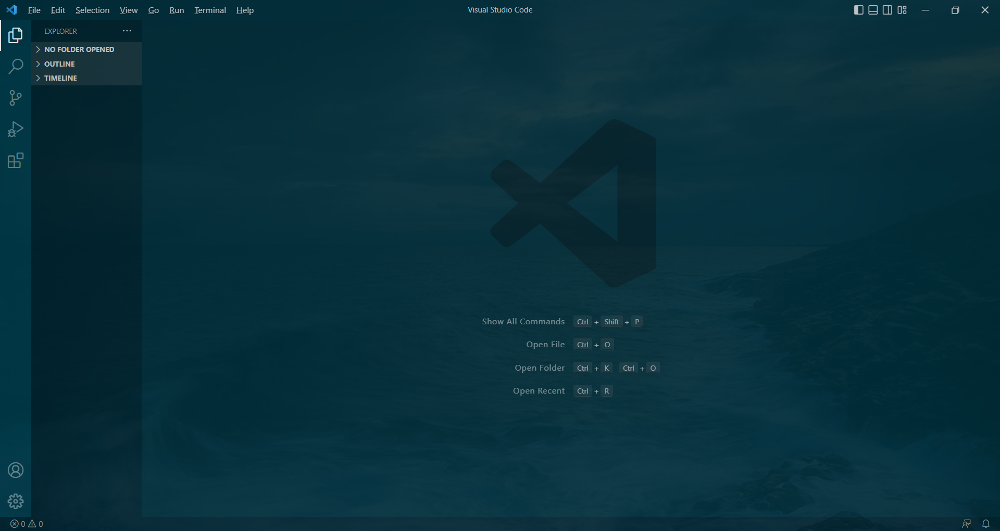
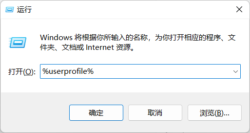
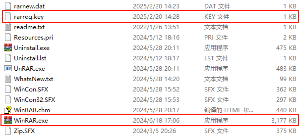

[TOC]

# 1 TortoiseGit

官网地址：https://tortoisegit.org/

# 2 TreeSize

官网地址：https://www.jam-software.com/

# 3 VS Code

## 3.1 安装

## 3.2 插件以及美化

1. vscode-icons ---  主题图标库
2. 美化之添加背景图片

```css
/*修改vscode css文件，workbench.desktop.main.css*/  
body{
    background-image: url("picture/vscode-6067736_960_720.jpg");
    background-size: 100%;
    opacity: 0.9;
    background-repeat: no-repeat;
  }
```

效果：




## 3.3 卸载

1. 控制面板卸载
2. 删除插件

<kbd>Win</kbd> + <kbd>R</kbd>，输入%userprofile%，删除:file_folder:.vscode目录




```bat
%userprofile%
```


1. 删除用户信息以及缓存

<kbd>Win</kbd> + <kbd>R</kbd>，输入%appdata%，删除:file_folder:code以及:file_folder: Visual Studio Code文件夹

# 4 解压缩软件

## 4.1 winrar

winrar贴吧，贴吧地址：https://jump2.bdimg.com/f?kw=winrar&ie=utf-8

1. 下载地址

官方原版链接：

- wrr暗链接：

64位：https://www.win-rar.com/fileadmin/winrar-versions/sc/sc20240528/wrr/winrar-x64-701sc.exe

- rrlb暗链接：

64位：https://www.win-rar.com/fileadmin/winrar-versions/sc/sc20240528/rrlb/winrar-x64-701sc.exe

2.授权文件

```key

RAR registration data  
Federal Agency for Education  
1000000 PC usage license  
UID=b621cca9a84bc5deffbf  
6412612250ffbf533df6db2dfe8ccc3aae5362c06d54762105357d  
5e3b1489e751c76bf6e0640001014be50a52303fed29664b074145  
7e567d04159ad8defc3fb6edf32831fd1966f72c21c0c53c02fbbb  
2f91cfca671d9c482b11b8ac3281cb21378e85606494da349941fa  
e9ee328f12dc73e90b6356b921fbfb8522d6562a6a4b97e8ef6c9f  
fb866be1e3826b5aa126a4d2bfe9336ad63003fc0e71c307fc2c60  
64416495d4c55a0cc82d402110498da970812063934815d81470829275

```

将注册码保存为rarreg.key文件，并放置于winrar安装目录根目录中，和WinRAR.exe文件同级。如图所示。




# 5 PDF阅读器（Sumatra PDF）

Sumatra PDF，简洁，小巧，具备基本的阅读已经标注能力。

https://www.sumatrapdfreader.org/free-pdf-reader


