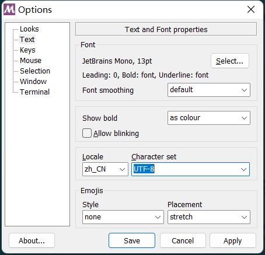

[TOC]

# 1 配置.gitignore文件

## 1.1 gitignore 文件作用

## 1.2 gitignore 添加方式

```gitignore
.gitignore
......
```

# 2 Git Bash配置显示中文

## 2.1 git status不显示中文

在默认设置下，中文文件名在工作区状态输出，中文名不能正确显示，而是显示为八进制的字符编码。

执行如下命令，将git配置文件 `core.quotepath`项设置为`false`。`quotepath`表示引用路径，加上`--global`表示全局配置

```shell
git config --global core.quotepath false
```

## 2.2 Git Bash终端显示中文乱码

设置文本编码格式为utf-8


