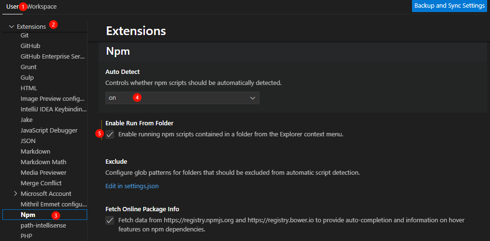

# 1 vscode 左侧菜单栏不显示Npm脚本





# 2 npm无法加载文件，因为在此系统上禁止运行脚本

- **问题现象**

npm : 无法加载文件 D:\02_envs\nodejs\npm.ps1，因为在此系统上禁止运行脚本。有关详细信息，请参阅 https:/go.microsoft.com/fwlink/
?LinkID=135170 中的 about_Execution_Policies。
所在位置 行:1 字符: 1
+ npm run serve
+ ~~~
    + CategoryInfo          : SecurityError: (:) []，PSSecurityException
    + FullyQualifiedErrorId : UnauthorizedAccess

- **解决方法**

以管理员身份运行powershell，将计算机上执行策略更改为RemoteSigned

```powershell

PS C:\Windows\system32> set-ExecutionPolicy RemoteSigned

执行策略更改
执行策略可帮助你防止执行不信任的脚本。更改执行策略可能会产生安全风险，如 https:/go.microsoft.com/fwlink/?LinkID=135170
中的 about_Execution_Policies 帮助主题所述。是否要更改执行策略?
[Y] 是(Y)  [A] 全是(A)  [N] 否(N)  [L] 全否(L)  [S] 暂停(S)  [?] 帮助 (默认值为“N”): y
PS C:\Windows\system32> get-ExecutionPolicy
RemoteSigned
PS C:\Windows\system32>

```


# 3 基于注解方式实现AOP，添加在接口上不生效

https://blog.csdn.net/liuyueyi25/article/details/117714585


